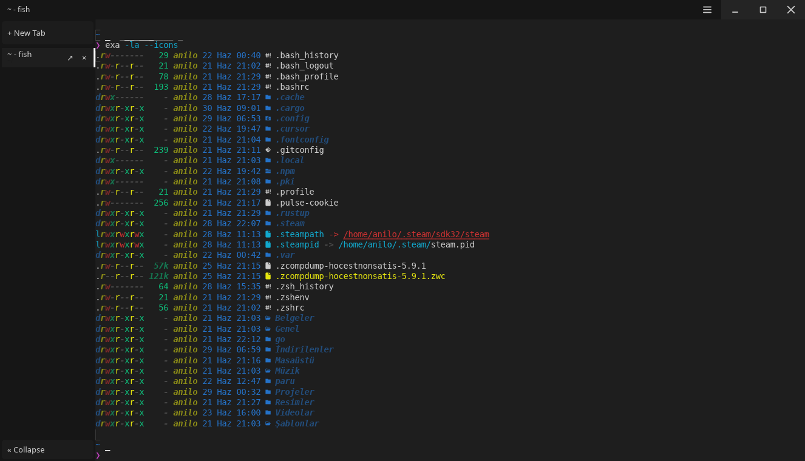

<div align="center">

# Sherion

**A high-performance, GPU-accelerated terminal emulator written in Rust.**

[](https://github.com/hocestnonsatis/sherion/actions/workflows/ci.yml)
[](https://github.com/hocestnonsatis/sherion/releases)
[](#license)
[](https://www.rust-lang.org/)
[](#install)

[Install](#install) · [Features](#features) · [Configuration](#configuration) · [Build from source](#build-from-source) · [Feature inventory](FEATURES.md)

</div>

<br>



<br>

Sherion is a modern terminal emulator built on **winit**, **wgpu**, and **vello** — with a custom title bar, tab sidebar, split panes, GPU text rendering, and full VT/ANSI compatibility via **alacritty_terminal**.

---

## Features

| | |
|---|---|
| **GPU rendering** | vello + wgpu pipeline with dirty-row tracking, glyph atlas, and ligatures |
| **Tabs & splits** | Sidebar tabs, detach to window, real split panes with mouse resize |
| **Search** | Full scrollback search with regex, case sensitivity, and whole-word match |
| **Input** | Kitty keyboard protocol, bracketed paste, IME, configurable keybindings |
| **Mouse** | SGR / X10 reporting, OSC 8 hyperlinks, rectangular selection |
| **Config** | TOML config with live reload, profiles, themes, and session restore |
| **Cross-platform** | Linux, macOS (Intel & Apple Silicon), Windows (ConPTY) |

See the full [feature inventory](FEATURES.md) for a detailed compatibility checklist.

---

## Install

Pre-built binaries are available on the [Releases](https://github.com/hocestnonsatis/sherion/releases) page.

**Linux / macOS**

```bash
curl --proto '=https' --tlsv1.2 -LsSf \
  https://github.com/hocestnonsatis/sherion/releases/latest/download/sherion-installer.sh | sh
```

**Windows (PowerShell)**

```powershell
irm https://github.com/hocestnonsatis/sherion/releases/latest/download/sherion-installer.ps1 | iex
```

**Windows (MSI)** — download `sherion-x86_64-pc-windows-msvc.msi` from [Releases](https://github.com/hocestnonsatis/sherion/releases).

**macOS (Homebrew)**

```bash
brew install hocestnonsatis/tap/sherion
```

Requires the [`hocestnonsatis/homebrew-tap`](https://github.com/hocestnonsatis/homebrew-tap) repository and `HOMEBREW_TAP_TOKEN` secret on the main repo for automated formula updates.

**Linux (.deb)**

Download `sherion_*_amd64.deb` from [Releases](https://github.com/hocestnonsatis/sherion/releases), then:

```bash
sudo dpkg -i sherion_*_amd64.deb
```

**Linux (.rpm)**

Download `sherion-*.rpm` from [Releases](https://github.com/hocestnonsatis/sherion/releases), then:

```bash
sudo dnf install ./sherion-*.rpm
```

**Linux (Flatpak)**

Download `sherion-x86_64.flatpak` from [Releases](https://github.com/hocestnonsatis/sherion/releases), then:

```bash
flatpak install --user sherion-x86_64.flatpak
```

**Linux (AppImage)**

Download `Sherion-x86_64.AppImage` from [Releases](https://github.com/hocestnonsatis/sherion/releases), make it executable, and run:

```bash
chmod +x Sherion-x86_64.AppImage
./Sherion-x86_64.AppImage
```

---

## Quick start

```bash
sherion
```

Enable debug logging:

```bash
RUST_LOG=sherion=debug sherion
```

Use a profile:

```bash
sherion --profile dark
```

---

## Configuration

Sherion reads config from (in order):

1. `SHERION_CONFIG` environment variable
2. `~/.config/sherion/sherion.toml` (or `$XDG_CONFIG_HOME/sherion/sherion.toml`)
3. `./sherion.toml` in the current directory (legacy fallback)

Copy or edit [`sherion.toml`](sherion.toml) as a starting point. See [SECURITY.md](SECURITY.md) for hardening guidance.

```bash
SHERION_CONFIG=/path/to/sherion.toml sherion
```

Key sections: `[font]`, `[colors]`, `[terminal]`, `[appearance]`, `[ui]`, `[keybindings]`, `[profiles.*]`.

---

## Build from source

**Requirements**

- Rust 1.88+
- GPU with Vulkan, Metal, DX12, or a compatible wgpu backend
- A monospace font (DejaVu Sans Mono, Liberation Mono, or Noto Sans Mono)

```bash
git clone https://github.com/hocestnonsatis/sherion.git
cd sherion
cargo build --release
./target/release/sherion
```

Optional SIMD UTF-8 acceleration:

```bash
cargo build --release --features simd-utf8
```

---

## Stack

| Layer | Crate |
|-------|-------|
| Window + events | [winit](https://github.com/rust-windowing/winit) 0.30 |
| GPU | [wgpu](https://github.com/gfx-rs/wgpu) 29 |
| Terminal core (grid, VTE, PTY) | [alacritty_terminal](https://github.com/alacritty/alacritty) 0.26 |
| Text shaping | [parley](https://github.com/linebender/parley) 0.10 |
| GPU rendering | [vello](https://github.com/linebender/vello) 0.9 |
| Config | serde + toml |

---

## Architecture

PTY I/O runs on a dedicated `alacritty_terminal` event-loop thread, isolated from the UI. The winit main thread shapes text with parley, builds vello scenes, and presents frames through wgpu with dirty-row damage tracking.

```
┌─────────────┐     MPSC      ┌──────────────────┐
│  PTY thread │ ────────────► │  winit UI thread │
│  (blocking  │               │  parley + vello  │
│   read)     │ ◄──────────── │  + wgpu present  │
└─────────────┘   input       └──────────────────┘
```

---

## License

MIT
